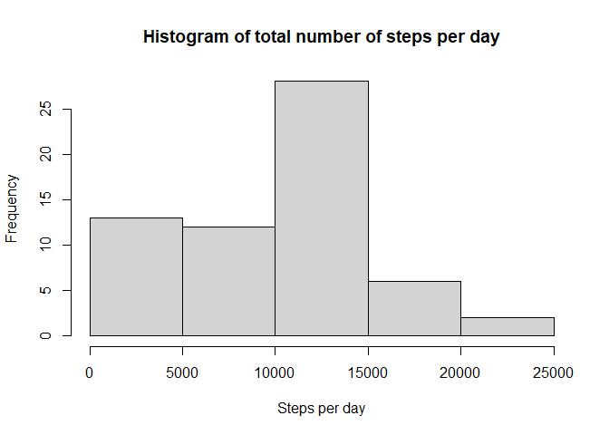

### Loading and processig the data

```r
data <- read.csv('activity.csv')
data$date <- as.Date(data$date)
```

### What is mean total number of steps taken per day?

```r
library(dplyr) 
```

```
## Warning: package 'dplyr' was built under R version 4.0.3
```

```
## 
## Attaching package: 'dplyr'
```

```
## The following objects are masked from 'package:stats':
## 
##     filter, lag
```

```
## The following objects are masked from 'package:base':
## 
##     intersect, setdiff, setequal, union
```

```r
stepsperday <- data %>% group_by(date) %>% summarize(sumstepsperday=sum(steps, na.rm = TRUE))
hist(stepsperday$sumstepsperday, main = "Histogram of total number of steps per day", xlab = "Steps per day")
```

<!-- -->

```r
meansteps <- mean(stepsperday$sumstepsperday)
mediansteps <- median(stepsperday$sumstepsperday)
```
**Mean** total number of steps per day:9354.2295082  
**Median** total number of steps per day:10395  

### What is the average daily activity pattern?

```r
stepsperinterval <- data %>% group_by(interval) %>% summarize(meanstepsperinterval=mean(steps, na.rm = TRUE))
plot(stepsperinterval$meanstepsperinterval ~ stepsperinterval$interval, type="l", main = "Time series plot with mean number of steps per interval", xlab="Intervals", ylab="Mean number of steps")
```

<!-- -->

```r
maxnumbersteps <- stepsperinterval$interval[which.max(stepsperinterval$meanstepsperinterval)]
```
**5-minute interval with the maximum number of steps**, on average across all the days:835

### Imputting missing data

```r
numbermissing <- sum(is.na(data$steps))

replacedNA <-data 
for (i in 1:nrow(data)){
        if(is.na(data$steps[i])){
                replacedNA$steps[i] <- stepsperinterval$meanstepsperinterval[replacedNA$interval[i] == stepsperinterval$interval]
        }
}

stepsperdaynona <- replacedNA %>% group_by(date) %>% summarize(sumstepsperdaynona=sum(steps))
hist(stepsperdaynona$sumstepsperdaynona, main = "Histogram of total number of steps per day", xlab = "Steps per day")
```

<!-- -->

```r
meanstepsnona <- mean(stepsperdaynona$sumstepsperdaynona)
medianstepsnona <- median(stepsperdaynona$sumstepsperdaynona)
```
**Total number of missing values**: 2304  
**Mean** total number of steps per day: 1.0766189\times 10^{4}  
**Median** total number of steps per day: 1.0766189\times 10^{4}  
Mean and median increased because NA's where ignored in the first analysis and where replaced by means in the second analysis.

### Are there differences in activity between weekdays and weekends?

```r
datadays <- replacedNA 
datadays$date <- as.Date(datadays$date)
datadays$typeofday <- ifelse(weekdays(datadays$date) %in% c("zaterdag", "zondag"), "weekend", "weekday")
datadays$typeofday <- as.factor(datadays$typeofday)

dataweekend <- datadays %>% filter(typeofday == "weekend") %>% group_by(interval) %>% summarize(meanstepsw = mean(steps))
dataweekend$typeofday <- "weekend"
dataweek <- datadays %>% filter(typeofday == "weekday") %>% group_by(interval) %>% summarise(meanstepsw = mean(steps))
dataweek$typeofday <- "weekday"

dataWW <- rbind(dataweekend, dataweek)
dataWW$typeofday <- as.factor(dataWW$typeofday)

library(ggplot2)
```

```
## Warning: package 'ggplot2' was built under R version 4.0.3
```

```r
g <- ggplot(dataWW, aes(interval, meanstepsw))
g + geom_line() + facet_grid (typeofday~.) + labs(title = "Plot with mean number of steps per interval during weekdays or weekenddays", x = "Intervals", y = "Mean number of steps")
```

<!-- -->
